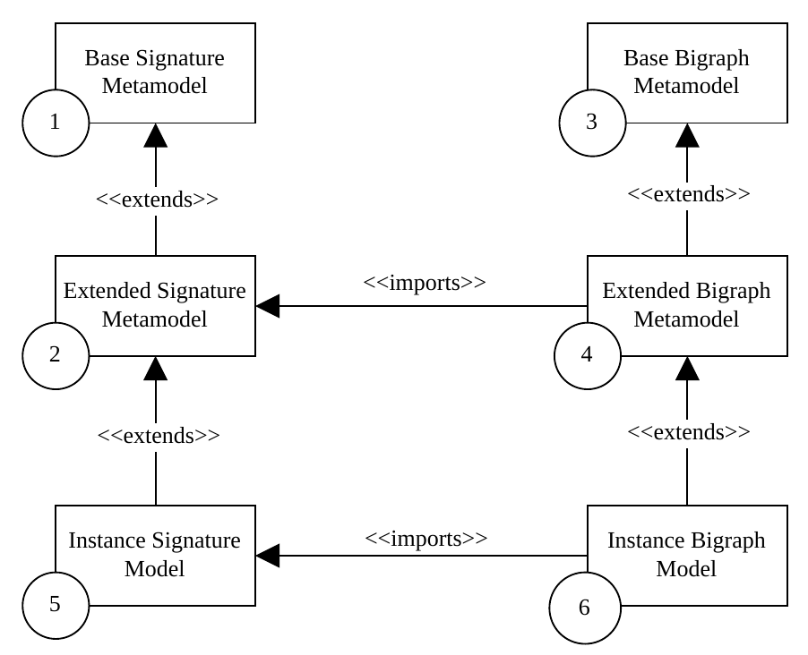

# Bigraph Ecore Metamodel (BEM): An EMOF-Compliant Specification for Bigraphs

<small>
(If you are looking just for the specification, visit the <a href="https://doi.org/10.5281/zenodo.10043063">digital repository on Zenodo</a>.)
</small>

The present project serves as a reference implementation of the abstract syntax specification for bigraphs, 
which was first presented in [[1]](#References). 
This implementation is achieved by utilizing the Ecore modeling language provided by the [Eclipse Modeling Framework (EMF)](https://projects.eclipse.org/projects/modeling.emf.emf).

This EMOF-compliant specification aligns with [[1]](#References), but it is subject to minor modifications as suggested in [[2]](#References).
Refer also to section ["Changes Made to the Original Specification"](#Changes-Made-to-the-Original-Specification) for a brief overview.

----

| Version       | Notice                                                                                               | 
|---------------|------------------------------------------------------------------------------------------------------|
| 1.6.0-SNAPSHOT | *(Draft) New namespace: org.bigraphs.model*                                                          |
| 1.5.0-SNAPSHOT | *(Draft) New build and deploy workflow; Dependencies updated*                                        |
| 1.4.0-SNAPSHOT | *(Draft) This project is an analogous implementation of [[1]](#References) with some minor changes.* |
----

## Introduction

### What Are Bigraphs?

Bigraphs [[3]](#References), devised by Robin Milner, are a formal modeling framework grounded on category theory and is widely employed in the field of computer science for the purpose of representing and analyzing complex systems.
Its primary application lies in the domain of concurrency, mobility, and interaction.
Bigraphs are an integral component of the wider domain of process algebra, offering a graphical and compositional framework for modeling systems, processes and agents, or any other dynamic, discrete structure.
The formalism of bigraphs was established by Milner to provide a means of representing non-trivial, dynamic systems in computer science.

### What Is EMF?

The Eclipse Modeling Framework (EMF) is a Java framework for building advanced software application frameworks and tools based on a structured data model.
EMF also provides code generation facilities and is part of the [Eclipse Modeling Project](https://projects.eclipse.org/projects/modeling).

### What Is Ecore?

Ecore in the context of EMF, refers to a _metamodeling language_ and is a key component of EMF that is used for defining the structure (classes, properties and relations) of models.
Ecore is founded upon a specific subset of the [MOF](http://www.omg.org/mof/) standard (and can thus be regarded as a reference implementation), which is well recognized as a metamodeling standard.

You can also say that Ecore is EMF's metamodel.
Ecore can be considered as an EMF model, hence functioning as its own metamodel.
The term EMF Ecore metamodel refers to the metamodel defined using Ecore.

Thus, when we say _Bigraph Ecore Metamodel (BEM)_ we are talking about the specific metamodel created using the Ecore modeling language within EMF.

### Why Metamodeling?

Metamodeling, a core principle and practice within the domain of Model-Driven Engineering (MDE), encompasses the creation of models for the purpose of describing other models. 
In essence, a metamodel can be described as a model that defines the structure, constraints, and relationships for instances of that metamodel.
Metamodels offer a systematic and universally accepted approach for defining the syntax and semantics of modeling languages, as well as the organization of models inside those languages.

### Rationale of This Specification

The metamodel for bigraphs is implemented using EMF's Ecore metamodel and called _Bigraph Ecore Metamodel (BEM)_. 
The BEM serves as pure data model to improve the interoperability with other bigraph tools, frameworks and libraries, thus, fostering the experimental evaluation of real-world applications. 

With this in mind, BEM serves as a specification for existing and future tools, and can be regarded as a common interface.
To enhance and streamline the process of separating concerns, it is recommended that additional tools incorporate distinct behavior superimposed on this metamodel.

Hence, the aim of this project is to provide a uniform implementation-agnostic specification language (i.e., metamodel) for bigraphs by moving implementation-specific details out from the metamodel.

## Contents

This project contains two metamodels serving different purposes:
- Root
  - model/
    - bigraphBaseModel.aird: This file is used for workspace management and organizing models, particularly within the Eclipse environment.
    - Signature Metamodel: Contains the specification to instantiate basic and dynamic signatures, and place-sorted signatures
      - signatureBaseModel.ecore
      - signatureBaseModel.genmodel
    - Bigraph Metamodel: Contains the specification for instantiating pure bigraphs
      - bigraphBaseModel.ecore
      - bigraphBaseModel.genmodel

The information of the dedicated signature metamodel is used to extend the base bigraph metamodel as described in [[2]](#References).

The `*.ecore` files define the static structure and semantics of a signature or bigraph.
Typically, the namespace, types, properties, operations and references of a signature or bigraph model are defined therein.

The `*.genmodel` files contain configuration settings that define how code should be generated from the associated Ecore metamodels. 
It specifies information such as the target programming language, and other code generation-related settings.

The `*.aird` file is used to store and manage model-driven development workspaces, which can include multiple related models (e.g., `.ecore`, `.genmodel`) and the relationships between them.
These files are not directly involved in code generation.

## Getting Started

### Eclipse Modeling Framework

Eclipse EMF can be used with the usual Eclipse IDE.
Then, Ecore models can be edited and extended via a graphical user-interface.
Refer to [[4, 5, 6]](#References) for an introduction.

### Generated API

Ecore supports the creation of an API from the given metamodels to access the functionality for creating bigraphs and signatures in Java.
Therefore, the `*.genmodel` files are provided for each metamodel.
The generated API and its metamodels are deployed as a Java library as discussed in the next section ["Library Approach"](#Library-Approach).

That may be enough for a experimental use cases. 
However, using the generated API directly has an artificial, less expressive character in terms of the bigraph theory (i.e., most of the nuances of the bigraphical semantics are hidden from the user), and is often cumbersome (i.e., extending the model with a signature by hand is time-consuming especially when many models with different signatures are going to be created, bigraph operators cannot be used to create complex bigraphs). 
Therefore, the [Bigraph Framework](https://bigraphs.org/products/bigraph-framework/) was developed and should be used to programmatically model bigraphs in Java.

### Library Approach

**Maven Configuration**

To use the signature and bigraph Ecore metamodels in any Maven-based Java project, the following dependencies have to be included in the `pom.xml`:
```xml
<dependency>
  <groupId>org.bigraphs.model</groupId>
  <artifactId>bigraph-ecore-model</artifactId>
  <version>${version}</version>
</dependency>

<!-- The related EMF dependencies should be provided as well -->
<dependency>
    <groupId>org.eclipse.emf</groupId>
    <artifactId>org.eclipse.emf.ecore</artifactId>
    <!-- Minimum: 2.23.0 -->
    <version>${emf.ecore.version}</version>
</dependency>
<dependency>
    <groupId>org.eclipse.emf</groupId>
    <artifactId>org.eclipse.emf.ecore.xmi</artifactId>
    <!-- Minimum: 2.16.0 -->
    <version>${emf.ecore.xmi.version}</version>
</dependency>
<dependency>
    <groupId>org.eclipse.emf</groupId>
    <artifactId>org.eclipse.emf.common</artifactId>
    <!-- Minimum: 2.21.0 -->
    <version>${emf.common.version}</version>
</dependency>
```

The artifacts are deployed to Maven Central.

## Changes Made to the Original Specification

Here, the changes made to the original metamodel introduced in [[1]](#References) are described:

- A class `BBigraph` is introduced representing a container for a whole bigraph and its parts. Formerly, the constituents of a bigraph were loosely coupled.
- A separate signature metamodel is introduced: `BSignature` and `BSorting`
  - The class `BKindSignature` is provided that implements kind bigraphs (i.e., place-sorted bigraphs)
- Setting and retrieving node attributes is supported
- The metamodel is migrated to be CDO-compatible
- Some interfaces are added for easier object management


Refer to [[2]](#References) for more details regarding the specific changes.

## How to Use the Specification



Refer to [[2]](#References) for more details concerning the workflow on how to use the metamodels.


## Build Configuration

> **Note:** The Java artifact is deployed to Maven Central.
> It includes the Ecore metamodels for signatures and pure bigraphs, and the generated APIs.
> Everything is packaged within the `*.jar`.

For this project, Maven is used as the build management tool.
It is not necessary to build from source to use the bigraph Ecore metamodel but
if you want to try out the latest version, the project can be easily built
with the regular `mvn` command.
The recommendation here is to build it with the regular `mvn` command.
You will need [Maven v3.6.3 or above](https://maven.apache.org/install.html).

> **Note:** The required version of Maven is 3.6.3 in combination with Java 11, and Maven 3.8.3 with Java 17.
> This project uses Java 17.

#### Initialize

First, checkout the `main` branch of this project:

```shell
git clone https://github.com/bigraph-toolkit-suite/bigraphs.bigraph-ecore-metamodel.git
```

The following command has to be run once:
```shell
mvn initialize
```
It installs some dependencies located in the `./libs/` folder of this project in your local Maven repository, which is usually located at `~/.m2/`.
These are required for the development.

### Building from Source

Execute the following goals to run the build:
```bash
$ mvn clean install
```
The `*.jar` can be found inside the `./target/` folder of this project.
The dependency will be also installed in the local Maven repository and 
can be used in other projects by following the instruction given [above](#Library-Approach)


### Deploying Artifacts

The Sonatype account details (username + password) for the deployment must be provided to the 
Maven Sonatype Plugin as used in the project's `pom.xml` file.

The Maven GPG plugin is used to sign the components for the deployment.
It relies on the gpg command being installed:
```shell
sudo apt install gnupg2
```

and the GPG credentials being available e.g. from `settings.xml`.

More information can be found [here](https://central.sonatype.org/publish/requirements/gpg/).

Execute the following goals to deploy a SNAPSHOT release of the Java artifact to the snapshot repository:

```bash
# Use the default settings.xml located at ~/.m2/
$ mvn clean deploy
```

To perform a release deployment execute:
```shell
mvn versions:set -DnewVersion=<VERSION>
mvn clean deploy -P release
```

## References

[1] _Kehrer, T. et al. (2016). An EMOF-Compliant Abstract Syntax for Bigraphs. Electronic Proceedings in Theoretical Computer Science, 231, 16-30. DOI: https://doi.org/10.4204/EPTCS.231.2._

[2] Grzelak, D: "Model-oriented Programming with Bigraphical
Reactive Systems: Theory and Implementation" (Dissertation), Technische Universität Dresden, 2023. (Submitted)

[3] _Milner, Robin: The Space and Motion of Communicating Agents. 1st. Aufl. New York, NY, USA : Cambridge University Press, 2009 — ISBN 978-0-521-73833-0_

[4] [https://www.vogella.com/tutorials/EclipseEMF/article.html](https://www.vogella.com/tutorials/EclipseEMF/article.html)

[5] _Steinberg, D.; Budinsky, F.; Paternostro, M: EMF: Eclipse Modeling Framework. 2nd Revised edition. Upper Saddle River, NJ : Addison-Wesley Professional, 2008 — ISBN 978-0-321-33188-5_

[6] https://eclipsesource.com/blogs/tutorials/emf-tutorial/


## License

This library is Open Source software released under the Apache 2.0 license.

```text
   Copyright 2023 Dominik Grzelak

   Licensed under the Apache License, Version 2.0 (the "License");
   you may not use this file except in compliance with the License.
   You may obtain a copy of the License at

 http://www.apache.org/licenses/LICENSE-2.0

   Unless required by applicable law or agreed to in writing, software
   distributed under the License is distributed on an "AS IS" BASIS,
   WITHOUT WARRANTIES OR CONDITIONS OF ANY KIND, either express or implied.
   See the License for the specific language governing permissions and
   limitations under the License. 
```


