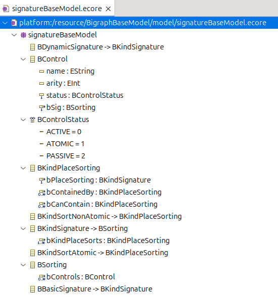
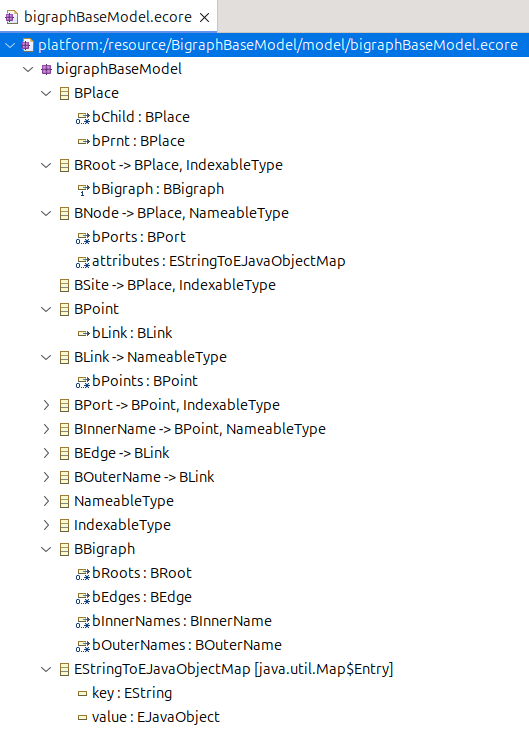

> Latest Version: **2.0.2**

---

# Bigraph Ecore Metamodel (BEM): An EMOF-Compliant Specification for Bigraphs

This project provides a **reference implementation** of the abstract syntax specification for *bigraphs*, originally introduced in [[1]](#references).  
The implementation is built using the **Ecore metamodeling language**, part of the [Eclipse Modeling Framework (EMF)](https://projects.eclipse.org/projects/modeling.emf.emf).

The specification is **EMOF-compliant** and follows [[1]](#references), with minor adjustments suggested in [[2]](#references).  
For details, see the section: [Changes Made to the Original Specification](#changes-made-to-the-original-specification).

[How to Cite this Artifact](#How-to-Cite-this-Artifact)

[FAQ](#FAQ)

> **Note:** This document is intended for developers and researchers working with modeling tools.  
> It is **not** aimed at end-users of the Bigraph Framework API.

----

| Version        | Notice                                                                                                                                    |
|----------------|-------------------------------------------------------------------------------------------------------------------------------------------|
| 2.0.2          | *[Release]* Technical Maintenance (CDO 48)                                                                                                |
| 2.0.1          | *[Release]* (CDO 48)                                                                                                                      |
| 1.6.1          | *[Release]* (CDO 48)                                                                                                                      |
| 1.6.1-SNAPSHOT | *[SNAPSHOT]* Dependency fix                                                                                                               |
| 1.6.0          | *[Release]*                                                                                                                               |
| 1.6.0-SNAPSHOT | *[Draft]* New namespace: org.bigraphs.model                                                                                               |
| 1.5.0-SNAPSHOT | *[Draft]* New build and deploy workflow; Dependencies updated                                                                             |
| 1.4.0-SNAPSHOT | *[Draft]* This project is an implementation of [[1]](#References) with some [minor changes](#changes-made-to-the-original-specification). |
----

## Rationale of this Specification

The **Bigraph Ecore Metamodel (BEM)** is implemented using EMF’s Ecore metamodel.  
It serves as a **pure data model** aimed at maximizing interoperability with tools, frameworks, and libraries, thereby enabling experimental evaluation of real-world applications.

BEM is intended as a **specification and common interface** for both current and future tools.  
To promote separation of concerns, additional tools should build distinct behavioral layers on top of this metamodel.

The overarching goal of this project is to provide a **uniform, implementation-agnostic specification language** for bigraphs, isolating all implementation-specific details from the metamodel itself.


## Contents

This project contains two metamodels serving different purposes:
- Root
  - model/
    - bigraphBaseModel.aird: This file is used for workspace management and organizing models, particularly within the Eclipse environment.
    - Signature Metamodel: Contains the specification to instantiate basic and dynamic signatures, and place-sorted signatures
      - signatureBaseModel.ecore
      - signatureBaseModel.genmodel
    - Bigraph Metamodel: Contains the specification for instantiating pure bigraphs
      - bigraphBaseModel.ecore
      - bigraphBaseModel.genmodel

The information of the dedicated signature metamodel is used to extend the base bigraph metamodel as described in [[2]](#References).

The `*.ecore` files define the static structure and semantics of a signature or bigraph.
Typically, the namespace, types, properties, operations and references of a signature or bigraph model are defined therein.

The `*.genmodel` files contain configuration settings that define how code should be generated from the associated Ecore metamodels. 
It specifies information such as the target programming language, and other code generation-related settings.

The `*.aird` file is used to store and manage model-driven development workspaces, which can include multiple related models (e.g., `.ecore`, `.genmodel`) and the relationships between them.
These files are not directly involved in code generation.

### Overview of the Structure

|  |  |
| ------------------------------------------------------------ | ------------------------------------------------------------ |
| Overview of the Base Signature MetaModel (*.ecore)           | Overview of the Base Bigraph MetaModel (*.ecore)             |

### Note on the Generated API

Ecore supports the *automatic generation* of an API from metamodels, enabling the creation and manipulation of bigraphs and signatures in Java or other supported languages. For this purpose, `*.genmodel` files are provided for each metamodel.

This approach may suffice for some experimental or lightweight use cases. However, using the generated API directly can feel artificial and less expressive from the perspective of bigraph theory. Many of the theoretical nuances of bigraphical semantics are abstracted away, making it harder to reason about or work with bigraphs at a conceptual level. Additionally, manually extending the model with signatures can be tedious—especially when multiple models with varying signatures are involved—and the absence of built-in bigraph operators complicates the construction of complex structures.

For these reasons, the [Bigraph Framework](https://bigraphs.org/products/bigraph-framework/) was developed. It provides a higher-level, programmatic interface for working with bigraphs in Java and is the recommended tool for most practical applications.

## Using the Metamodel in a Project

### Maven Configuration

To use the signature and bigraph Ecore metamodels in any Maven-based/Gradle-based Java project, the following dependencies have to be included in the `pom.xml`:

```xml
<dependency>
  <groupId>org.bigraphs.model</groupId>
  <artifactId>bigraph-ecore-model</artifactId>
  <version>${version}</version>
</dependency>

<!-- The related EMF dependencies should be provided as well to work with Ecore -->
<dependency>
    <groupId>org.eclipse.emf</groupId>
    <artifactId>org.eclipse.emf.ecore</artifactId>
    <!-- Minimum: 2.23.0 -->
    <version>${emf.ecore.version}</version>
</dependency>
<dependency>
    <groupId>org.eclipse.emf</groupId>
    <artifactId>org.eclipse.emf.ecore.xmi</artifactId>
    <!-- Minimum: 2.16.0 -->
    <version>${emf.ecore.xmi.version}</version>
</dependency>
<dependency>
    <groupId>org.eclipse.emf</groupId>
    <artifactId>org.eclipse.emf.common</artifactId>
    <!-- Minimum: 2.21.0 -->
    <version>${emf.common.version}</version>
</dependency>
```

### Gradle Configuration

```
ext {
    version = '2.0.1' // or whatever the latest BEM version is
    emfEcoreVersion = '2.23.0' // Minimum: 2.23.0
    emfEcoreXmiVersion = '2.16.0' // Minimum: 2.16.0
    emfCommonVersion = '2.21.0' // Minimum: 2.21.0
}

dependencies {
    implementation "org.bigraphs.model:bigraph-ecore-model:${version}"

    // EMF dependencies
    implementation "org.eclipse.emf:org.eclipse.emf.ecore:${emfEcoreVersion}"        
    implementation "org.eclipse.emf:org.eclipse.emf.ecore.xmi:${emfEcoreXmiVersion}"  
    implementation "org.eclipse.emf:org.eclipse.emf.common:${emfCommonVersion}"       
}
```

## Conceptual Usage of the Specification


Refer to [[2]](#References) for more details concerning the workflow on how to use the metamodels.

## FAQ

### Changes Made to the Original Specification

Here, the changes made to the original metamodel introduced in [[1]](#References) are described:

- A class `BBigraph` is introduced representing a container for a whole bigraph and its parts. Formerly, the constituents of a bigraph were loosely coupled.
- A separate signature metamodel is introduced: `BSignature` and `BSorting`
  - The class `BKindSignature` is provided that implements kind bigraphs (i.e., place-sorted bigraphs)
- Setting and retrieving node attributes is supported
- The metamodel is migrated to be CDO-compatible
- Some interfaces are added for easier object management


Refer to [[2]](#References) for more details regarding the specific changes.

### What are Bigraphs?

Bigraphs [[3]](#references), introduced by Robin Milner, are a **formal modeling framework** grounded in category theory and used in computer science to represent and analyze complex systems. 
Their main applications are in **concurrency**, **mobility**, and **interaction**.

Within the broader field of **process algebra**, bigraphs offer a **graphical and compositional approach** to modeling systems, processes, agents, and other dynamic, discrete structures.

### What Is EMF?

The EMF is a Java-based framework for developing structured data models and building sophisticated software tools and application frameworks around them.
 It includes facilities for model definition, code generation, and runtime support, and is a core component of the [Eclipse Modeling Project](https://projects.eclipse.org/projects/modeling).

### What Is Ecore?

Ecore, in the context of EMF, is a metamodeling language and a central component of the framework. It is used to define the structure of models—such as classes, attributes, and relationships.
Ecore is based on a subset of the [MOF](http://www.omg.org/mof/) (Meta Object Facility) standard and can be regarded as a reference implementation of it. MOF is a widely recognized standard for metamodeling in software engineering.

You can also say that Ecore is EMF’s metamodel. Ecore can be considered an EMF model, thus functioning as its own metamodel.

Therefore, when we say *Bigraph Ecore Metamodel (BEM)*, we refer to the custom-designed base metamodel created using the Ecore modeling language within EMF.

### Why Metamodeling?

Metamodeling is a fundamental concept and practice within Model-Driven Engineering (MDE) that involves creating models to describe other models. 
In essence, a metamodel defines the structure, constraints, and relationships that its model instances must follow.
Metamodels provide a systematic and widely accepted way to define the syntax and semantics of modeling languages, as well as the organization of models within those languages.

## How to Cite this Artifact

BibTeX:
```text
@misc{grzelak_2023_10043063,
  author       = {Grzelak, Dominik},
  title        = {{Bigraph Ecore Metamodel (BEM): An EMOF-Compliant Specification for Bigraphs}},
  month        = oct,
  year         = 2023,
  publisher    = {Zenodo},
  doi          = {10.5281/zenodo.10043063},
  url          = {https://doi.org/10.5281/zenodo.10043063}
}
```

## References

- [1] Kehrer, T. et al. (2016). An EMOF-Compliant Abstract Syntax for Bigraphs. Electronic Proceedings in Theoretical Computer Science, 231, 16-30. DOI: https://doi.org/10.4204/EPTCS.231.2.
- [2] D. Grzelak, Model-oriented Programming with Bigraphical Reactive Systems: Theory and Implementation. Dresden University of Technology, Germany, 2024. https://nbn-resolving.org/urn:nbn:de:bsz:14-qucosa2-910504
- [3] Milner, Robin: The Space and Motion of Communicating Agents. 1st. Aufl. New York, NY, USA : Cambridge University Press, 2009 — ISBN 978-0-521-73833-0
- [4] [https://www.vogella.com/tutorials/EclipseEMF/article.html](https://www.vogella.com/tutorials/EclipseEMF/article.html)
- [5] Steinberg, D.; Budinsky, F.; Paternostro, M: EMF: Eclipse Modeling Framework. 2nd Revised edition. Upper Saddle River, NJ : Addison-Wesley Professional, 2008 — ISBN 978-0-321-33188-5
- [6] [https://eclipsesource.com/blogs/tutorials/emf-tutorial/](https://eclipsesource.com/blogs/tutorials/emf-tutorial/)

## License

The specification and this library are released under the Apache 2.0 license.

```text
Copyright 2019-present Bigraph Toolkit Developers

   Licensed under the Apache License, Version 2.0 (the "License");
   you may not use this file except in compliance with the License.
   You may obtain a copy of the License at

 https://www.apache.org/licenses/LICENSE-2.0

   Unless required by applicable law or agreed to in writing, software
   distributed under the License is distributed on an "AS IS" BASIS,
   WITHOUT WARRANTIES OR CONDITIONS OF ANY KIND, either express or implied.
   See the License for the specific language governing permissions and
   limitations under the License. 
```
